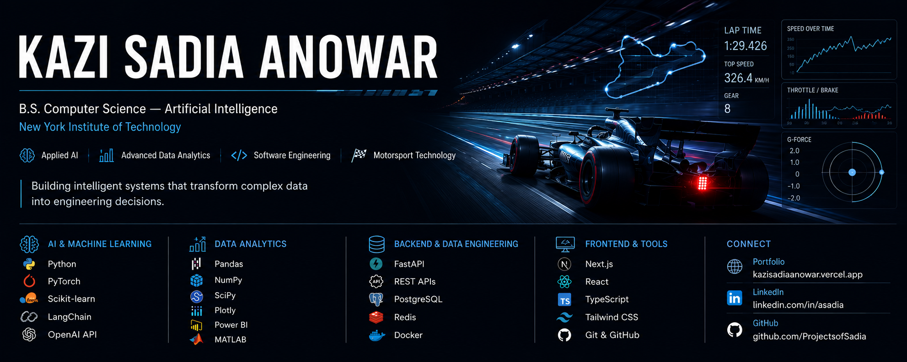

  

# Kazi Sadia Anowar

## Applied AI • Motorsport Analytics • Research • Data Systems

I build AI, data, and research systems focused on motorsport performance, telemetry, simulation, and real-world decision support.

### Research & Featured Work
- 🏎️ **RaceCast Research** — Explainable cross-circuit Formula 1 lap-time decomposition using FastF1, scikit-learn, SHAP, and leave-one-circuit-out validation
- 🔥 **TireTwin** — Formula 1 tire thermal modeling and uncertainty analysis using MATLAB, FastF1, and Monte Carlo simulation
- 🏁 **GreenHell Analytics** — Endurance-racing analytics focused on lap-time performance, pit stops, consistency, and strategy
- 🤖 **PitMind AI** — Retrieval-based race-engineering assistant with evaluation metrics and citation safeguards
- ⚙️ **RaceCast Platform** — Real-time Formula 1 telemetry replay platform using FastAPI, WebSockets, PostgreSQL, Redis, and Next.js

### Research Interests
- Motorsport Analytics
- Race Telemetry & Performance Analysis
- Explainable Artificial Intelligence
- Vehicle Dynamics & Simulation
- Uncertainty Quantification
- Endurance Racing Strategy
- Applied Machine Learning

### Technical Skills
**AI & ML:** scikit-learn, SHAP, RAG, AI Evaluation, Prompt Engineering, Monte Carlo Simulation

**Data & Scientific Computing:** Python, SQL, Pandas, NumPy, MATLAB, Plotly

**Backend & Data Systems:** FastAPI, PostgreSQL, Redis, WebSockets, REST APIs, Docker

**Frontend:** Next.js, React, TypeScript, Tailwind CSS

### Current Focus
- GreenHell Analytics research on pace, consistency, stint evolution, and pit strategy in endurance racing
- Motorsport performance modeling and telemetry research
- Applied AI systems for race-engineering decision support
- Publishing reproducible research and technical case studies

### Research Identity
- ORCID: https://orcid.org/0009-0002-3777-9014

### Connect
- LinkedIn: https://www.linkedin.com/in/asadia/
- Portfolio: https://kazisadiaanowar.vercel.app
- GitHub: https://github.com/ProjectsofSadia
- Email: sadiaanowar20@gmail.com
